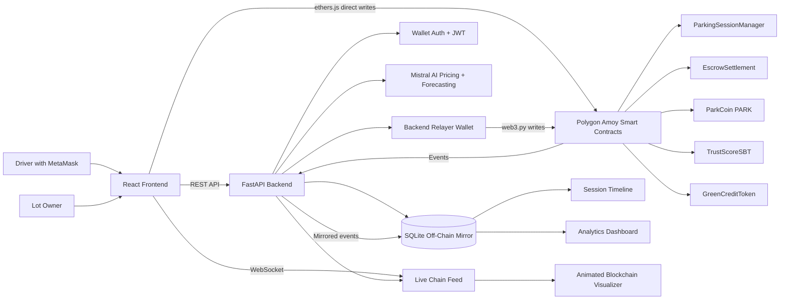
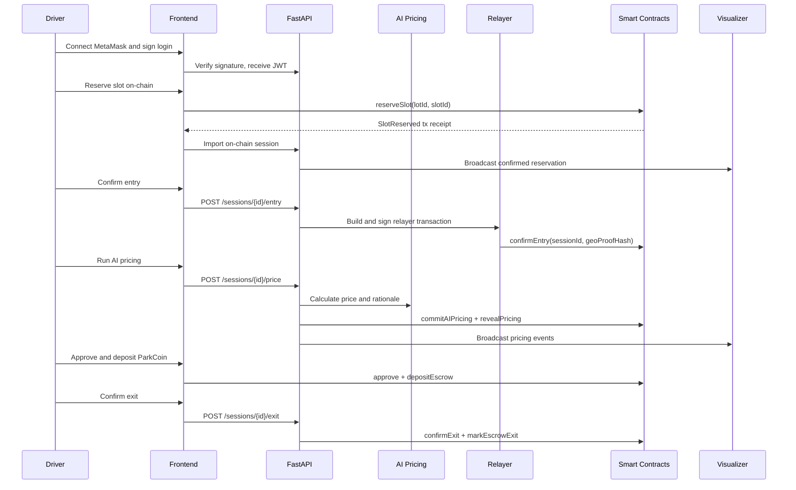

<p align="center">
  
</p>

<p align="center">
  Blockchain-verified smart parking with wallet identity, verifiable AI pricing, ParkCoin escrow, trust score SBTs, green credits, and a live blockchain activity visualizer.
</p>

<p align="center">
  
  
  
  
  
  
</p>

---

<p align="center">
  <a href="#problem-statement">Problem</a> |
  <a href="#solution-overview">Solution</a> |
  <a href="#feature-set">Features</a> |
  <a href="#architecture-diagram">Architecture</a> |
  <a href="#animated-demo-layer">Animations</a> |
  <a href="#quick-start">Quick Start</a>
</p>

## Problem Statement


Parking systems are still built around private databases that drivers and parking owners must simply trust. A driver cannot easily prove that a slot was truly reserved, that the booking was not overwritten, that dynamic pricing was calculated fairly, or that payment was released only after the correct exit conditions. Lot owners also face no-shows, unreliable users, opaque disputes, and limited tools for verifiable settlement.

The result is a trust gap:

- Drivers cannot independently verify reservations, prices, or receipts.
- Owners cannot reliably enforce booking integrity or user reputation.
- Dynamic pricing feels opaque and easy to manipulate.
- Disputes depend on private support records.
- Sustainability rewards and loyalty points remain locked inside one platform.

ParkChain Nexus turns parking into an auditable trust workflow instead of a private-database promise.

## Solution Overview


<p align="center">
  
  
  
</p>

ParkChain Nexus is a hybrid smart parking platform where the backend handles speed and usability while blockchain handles proof, trust, and settlement.

Drivers connect with MetaMask, reserve parking slots, confirm entry and exit, run AI-based pricing, deposit ParkCoin into escrow, earn green credits, and build a wallet-linked trust score. The system mirrors critical blockchain events into SQLite so the frontend can render fast dashboards, timelines, analytics, and a live node-link blockchain visualizer.

The project supports both:

- **No-POL rehearsal mode** for safe local demonstrations without spending gas.
- **Live Polygon Amoy mode** for real on-chain proof using test POL.

Along the way, ParkChain Nexus was updated with practical demo safeguards:

- `DEMO_CHAIN_FALLBACK=true` lets relayer-backed steps continue locally if Amoy/RPC fails.
- Fallback responses preserve the real chain error so issues remain debuggable.
- Transaction hashes are normalized so real chain links display correctly.
- Polygon Amoy POA middleware is installed for reliable web3.py receipt reads.
- A ParkCoin faucet mints demo PARK to the connected wallet for escrow demonstrations.
- Timeline events are de-duplicated when imported first from MetaMask and later synced from chain logs.

## Feature Set


| Feature | What It Demonstrates | User Benefit |
|---|---|---|
| Wallet login | MetaMask signature authentication without passwords | Safer identity, no password storage |
| Lot and slot management | Backend-managed lots, EV flags, premium slots, trust gates | Practical owner workflow |
| Local reservation mode | Full rehearsal without gas | Safe testing before demo |
| On-chain reservation | Smart contract slot reservation on Polygon Amoy | Public proof and double-booking protection |
| Entry and exit lifecycle | Parking state machine and timeline events | Clear session history |
| Verifiable AI pricing | Commit/reveal hash for AI pricing inputs | Transparent dynamic pricing |
| Mistral-powered rationale | Human-readable explanation for price changes | Easier trust and presentation |
| ParkCoin escrow | Approve, deposit, exit marking, and release flow | Fair settlement between driver and owner |
| ParkCoin faucet | Demo PARK minting to the connected wallet | Escrow can be demonstrated without manual token scripts |
| TrustScore SBT | Wallet-linked reputation score | Premium access and accountability |
| GreenCreditToken | EV/sustainability reward token | Incentivizes greener behavior |
| Disputes | Raise and resolve disputed sessions | Structured conflict trail |
| Immutable timeline | Event-by-event session receipt | Auditability and presentation clarity |
| Live blockchain visualizer | Mempool, pending, block, and confirmed event animation | Makes blockchain understandable |
| Analytics dashboard | Occupancy, event distribution, throughput, KPIs | Operator insight |
| Owner panel | Create lots and slots from the frontend | Multi-lot network readiness |
| Settings page | Chain status, relayer, contract addresses | Debuggable deployments |

## Technology Stack


| Layer | Technology |
|---|---|
| Frontend | React, Vite, TypeScript, TailwindCSS |
| Frontend routing | TanStack Router / React Start structure |
| UI and motion | Radix UI, lucide-react, Framer Motion |
| Visualizer | React Flow, Recharts, WebSocket-driven events |
| Wallet and contract calls | MetaMask, ethers.js v6 |
| Backend | FastAPI, Python |
| API validation | Pydantic / pydantic-settings |
| Database | SQLite, SQLAlchemy ORM |
| Blockchain backend | web3.py, eth-account |
| Smart contracts | Solidity, Hardhat |
| Test network | Polygon Amoy |
| AI | Mistral API with local fallback pricing logic |
| Auth | Wallet signature challenge + JWT |
| Testing | Pytest, FastAPI TestClient, Hardhat tests |

## Architecture Diagram




## Transaction Journey



## Animated Demo Layer


ParkChain Nexus is designed to feel alive during a presentation. The frontend includes an animated blockchain visualizer that turns invisible blockchain mechanics into a clear motion story:

<p align="center">
  
</p>

The visualizer explains:

- A transaction begins as a pending action.
- It moves toward block assembly.
- It becomes confirmed.
- It appears in the immutable session timeline.
- It contributes to analytics and operational insight.

This makes the blockchain layer visible to non-technical audiences instead of hiding it behind a final status message.

## Demo Media

The README already includes animated motion assets. After recording your final demo, place the recording at:

```text
docs/assets/parkchain-demo.mp4
```

or:

```text
docs/assets/parkchain-demo.gif
```

Recommended README embed after adding the file:

```html
<video src="./docs/assets/parkchain-demo.mp4" controls width="900"></video>
```

Current motion preview:

<p align="center">
  
</p>

Suggested recording sequence:

1. Login with MetaMask.
2. Reserve a slot on-chain.
3. Show the visualizer moving the reservation into a confirmed event.
4. Confirm entry and run AI pricing.
5. Use Get demo PARK, approve, and deposit escrow.
6. Confirm exit and show the immutable timeline.

## Smart Contracts

| Contract | Purpose |
|---|---|
| `ParkingSessionManager.sol` | On-chain parking session state machine: reservation, entry, pricing, exit, disputes |
| `ParkCoin.sol` | Demo parking payment token used by escrow |
| `EscrowSettlement.sol` | Holds ParkCoin until exit and dispute-window rules allow release |
| `TrustScoreSBT.sol` | Non-transferable wallet reputation score |
| `GreenCreditToken.sol` | EV and sustainability reward token |

## Backend Capabilities

- Wallet challenge + signature verification.
- JWT-protected driver APIs.
- SQLAlchemy models for users, lots, slots, sessions, chain events, pricing logs, trust history, disputes, and local green-credit mirror records.
- web3.py contract bindings with Polygon Amoy POA middleware.
- Relayer wallet for system-level on-chain actions.
- Chain event sync and de-duplication.
- Mistral AI pricing and forecasting.
- Commit/reveal pricing proof.
- Demo fallback mode with preserved chain error diagnostics.
- ParkCoin faucet endpoint for escrow demos.
- WebSocket broadcasting for live visualizer updates.

## Frontend Capabilities

- Branding page and wallet login.
- Dashboard with network, lots, activity, trust, and green-credit snapshots.
- Parking map with local-only and on-chain reservation paths.
- Session screen with entry, AI pricing, exit, disputes, escrow, and timeline.
- ParkCoin escrow controls: faucet, approve, deposit, release.
- Trust score profile with mint and adjustment actions.
- Green credits page with mint and redeem actions.
- Owner lot creation panel.
- Animated blockchain visualizer.
- Analytics dashboard.
- Settings page for API, WebSocket, relayer, and contract diagnostics.

## Demo Modes

| Mode | When To Use | Behavior |
|---|---|---|
| Local rehearsal | Before a presentation or when saving test POL | Uses backend/local events without MetaMask gas |
| Live Amoy demo | Final proof run | Uses MetaMask and relayer transactions on Polygon Amoy |
| Demo fallback | During live demos where RPC or relayer actions may fail | Continues the UI flow locally while preserving the actual chain error |

`DEMO_CHAIN_FALLBACK=true` is useful for presentation resilience. If you want strict real-chain failure behavior, set it to `false`.

## Impact And Benefits

### For Drivers

- Verifiable reservation proof.
- Transparent AI pricing.
- Better dispute evidence.
- Wallet-based identity.
- Reward visibility through green credits.
- Fairer escrow-based settlement.

### For Parking Owners

- Stronger double-booking prevention.
- Trust-gated premium slots.
- Payment assurance through escrow.
- Analytics for occupancy and throughput.
- Fewer opaque disputes.
- Multi-lot management foundation.

### For Evaluators And Demonstrators

- Real blockchain is not hidden behind a button.
- The visualizer makes mempool, pending, blocks, and confirmed events explainable.
- The project shows a full workflow: identity, reservation, pricing, payment, reputation, reward, dispute, and analytics.

## Repository Navigation Guide

| Need | Start Here |
|---|---|
| Big-picture project idea | `ParkChain-Nexus-Implementation-Spec.md` |
| Feature significance in simple language | `PARKCHAIN_FEATURE_SIGNIFICANCE_EXPLAINER.md` |
| Manual test and demo workflow | `MANUAL_FRONTEND_BACKEND_TEST_WORKFLOW.md` |
| Setup instructions | `SETUP_GUIDE.md` |
| Folder map | `FOLDER_STRUCTURE.md` |
| Backend API source | `backend/app/api/` |
| Backend chain helpers | `backend/app/chain/` |
| Backend AI engines | `backend/app/ai/` |
| Database models | `backend/app/db/models.py` |
| Solidity contracts | `contracts/contracts/` |
| Deployment and gas scripts | `contracts/scripts/` |
| Frontend routes/pages | `frontend/src/routes/` |
| Frontend contract helpers | `frontend/src/lib/contracts.ts` |
| Frontend API client | `frontend/src/lib/api.ts` |
| Live visualizer component | `frontend/src/components/ChainVisualizer.tsx` |
| Frontend config | `frontend/src/config/index.ts` |
| Backend env template | `backend/.env.example` |
| Python dependencies | `backend/requirements.txt` and root `requirements.txt` |
| Frontend dependencies | `frontend/package.json` |
| Contract dependencies | `contracts/package.json` |

## Quick Start

See the full guide in `SETUP_GUIDE.md`.

```powershell
cd backend
.\.venv\Scripts\python.exe -m uvicorn app.main:app --host 127.0.0.1 --port 8000
```

```powershell
cd frontend
npm.cmd run dev
```

Open:

```text
http://127.0.0.1:5173
```

## Verification

Backend:

```powershell
cd backend
.\.venv\Scripts\python.exe -m pytest
```

Frontend:

```powershell
cd frontend
npm.cmd run build
```

Contracts:

```powershell
cd contracts
npx.cmd hardhat test
```

## Status

ParkChain Nexus currently implements the backend, smart contracts, frontend integration, live visualizer, manual test workflow, local rehearsal path, live Amoy path, fallback diagnostics, and ParkCoin faucet needed for escrow demonstration.

The frontend and backend are intentionally separated:

```text
backend/
frontend/
contracts/
```

This keeps API, UI, and smart-contract ownership clean and makes later deployment easier.

---

<h2 align="center">
  <strong>Proof that the smartest journeys begin before the engine starts.</strong>
</h2>
